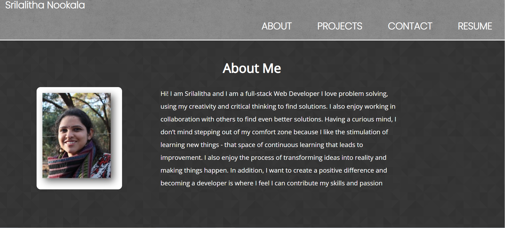
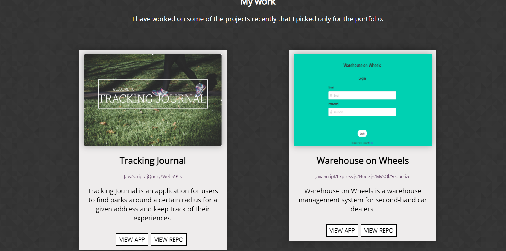
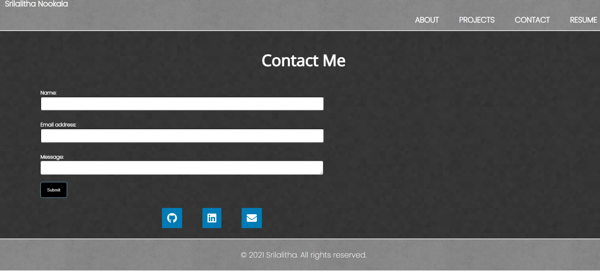
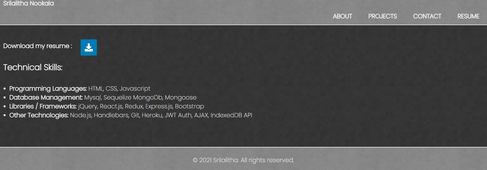

# React Portfolio

# Description 
* Hello Developers! My name is Srilalitha. I have done full-stack web development from Monash Bootcamp and I am ready to start a career in web-development!
* I have created a Portfolio Website using React to showcase my work.

## Table of Contents

- [Description](#Description)
- [Screenshots](#Screenshots)
- [Links](#Links)
- [Questions](#Questions)

# Screenshots
* The following are the screenshots of the website's apperance.
  * Homepage (About me) 
  * Projects 
  * Contact Page 
  * Resume 

  # Links
  * The following is the link to the deployed code : https://github.com/SrilalithaN/reactportfolio

  * The following is the link to deployed application : 

  # Questions
  * If you have any questions feel free to reach me at at snookala.dev@gmail.com
